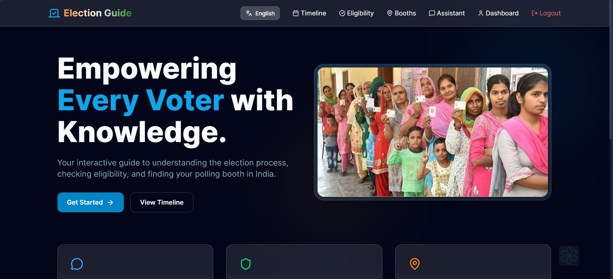
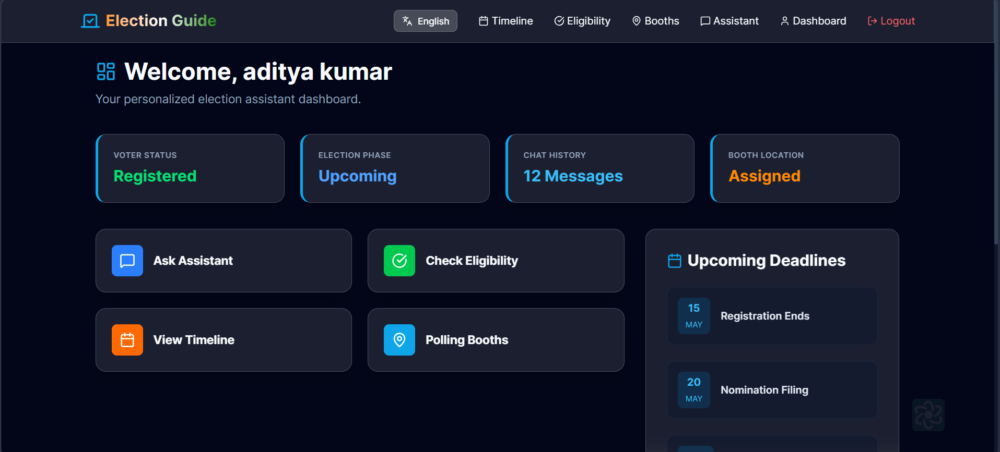
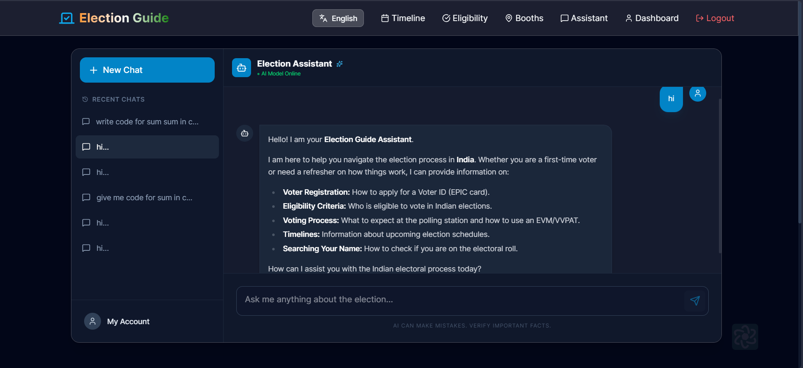
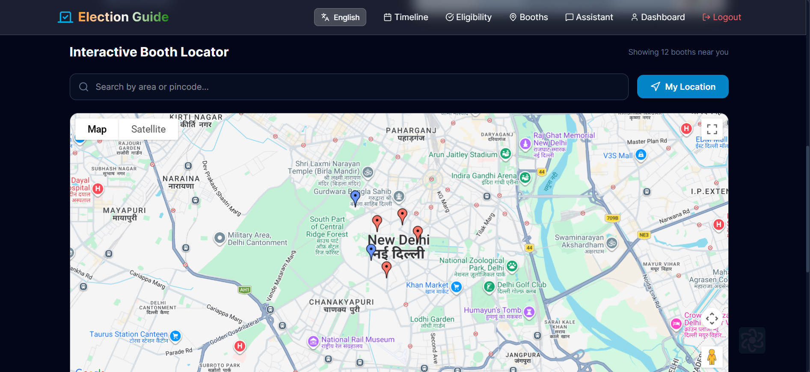
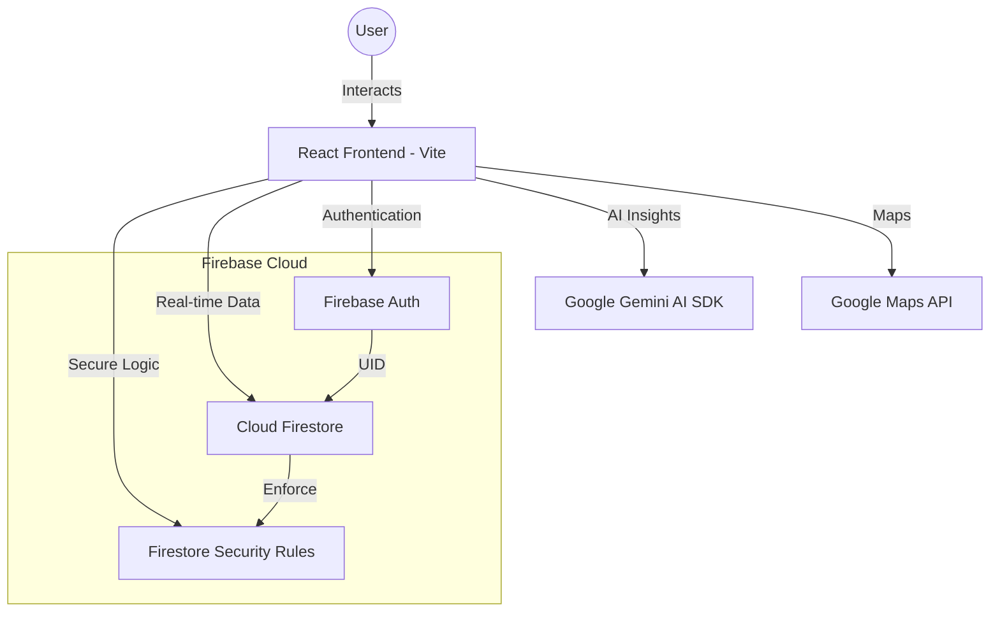

# 🗳️ Election Guide Assistant - Serverless Edition

[](https://firebase.google.com/)
[](https://reactjs.org/)
[](https://vitejs.dev/)
[](https://firebase.google.com/products/firestore)

A fully serverless, highly scalable, and secure web application for Indian election assistance and voting. This project has been migrated from a MERN stack to a **Firebase-centric architecture** to ensure maximum performance, real-time updates, and robust security.

---

## 📸 Project Demos

| Hero Section | User Dashboard |
| :---: | :---: |
|  |  |

| AI Chat Assistant | Interactive Map |
| :---: | :---: |
|  |  |

---

## 🚀 Project Overview

The **Election Guide Assistant** is a digital companion for voters, designed to simplify democratic participation. By moving to a serverless architecture, we have eliminated backend maintenance, improved scalability, and implemented real-time voting results without the overhead of custom WebSockets or polling.

## 🛑 Problem Statement

Navigating the electoral process in a large democracy can be overwhelming. Citizens face:
- **Information Overload**: Finding reliable registration info is hard.
- **Location Confusion**: Locating polling booths is challenging.
- **Fraud Risks**: Ensuring "one user, one vote" in a digital environment.

This project addresses these issues using a **Firebase-powered, AI-driven intuitive interface**.

## 🏗️ Firebase Architecture

The application is built on a modern serverless stack:



## ✨ Key Features

- **🛡️ Secure Firebase Auth**: Instant signup/login with persistent sessions.
- **🗳️ One-Person-One-Vote**: Strict Firestore rules and application logic prevent duplicate voting.
- **🧠 AI-Based Fraud Detection**: Rule-based intelligence flags "Blast Voting" and suspicious high-frequency patterns.
- **📊 Real-time Voting Results**: Live tallies using Firestore's `onSnapshot` listeners.
- **🤖 Gemini AI Assistant**: Direct integration for electoral guidance.
- **📍 Interactive Maps**: Google Maps integration for booth location.

## 🔒 Security & Fraud Detection

### Firestore Security Rules
- **Authentication Required**: No data access without a valid Firebase UID.
- **Ownership Enforcement**: Users can only read/write their own profiles.
- **Immutability**: Once a vote is cast, it cannot be edited or deleted.
- **Server Timestamps**: Ensures all votes are recorded with trusted server time.

### 🧠 AI Fraud Detection Logic
The system uses an intelligent rule-based monitor in `voteService.js`:
- **Blast Voting Check**: Before a vote is accepted, the system analyzes the most recent global votes.
- **Pattern Matching**: If 10+ votes are detected within 5 seconds, the activity is flagged as "Suspicious" and logged.
- **Metadata Tracking**: Each vote records User-Agent and Platform data to identify bot-driven attempts.

## 🛠️ Tech Stack

- **Frontend**: React 19 (Vite)
- **Backend**: **Fully Serverless (Firebase)**
- **Authentication**: Firebase Auth
- **Database**: Cloud Firestore
- **AI**: Google Gemini AI
- **Optimization**: Route-level lazy loading & code-splitting

---

## 🛠️ Setup Steps

1. **Clone the Repo**:
   ```bash
   git clone https://github.com/shivam11006/election-process-assistance.git
   ```

2. **Setup Firebase**:
   - Create a project on [Firebase Console](https://console.firebase.google.com/).
   - Enable **Authentication** (Email/Password).
   - Create a **Firestore Database**.
   - Copy your config to `client/.env.development.local`.

3. **Install Dependencies**:
   ```bash
   cd client
   npm install
   ```

4. **Deploy Rules**:
   - Copy the content of `firestore.rules` to the Rules tab in your Firebase Console.

5. **Run Locally**:
   ```bash
   npm run dev
   ```

---

Built for a stronger democracy 🇮🇳 by [Shivam](https://github.com/shivam11006)

